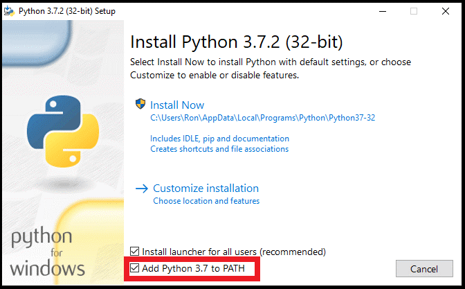
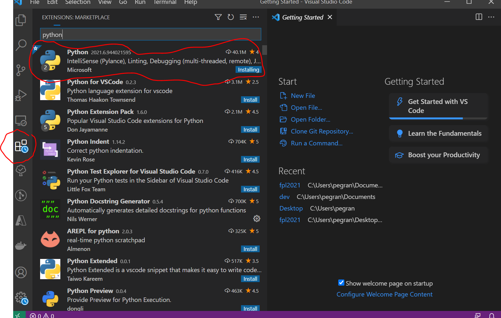
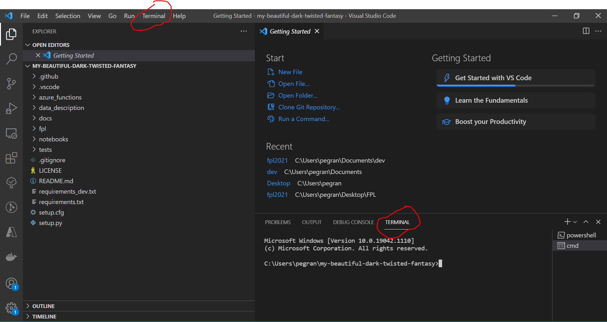
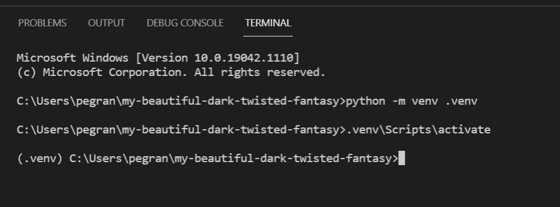

# 1. Install programs

1. Install python --> [python.org/downloads](https://www.python.org/downloads/)
    * **REMEMBER TO ADD PYTHON TO PATH**
    
    * Now you can type ‘python’ in command prompt to open python shell
    ```cmd
    python
    ```
2. Install Visual Studio Code (VSCODE) [code.visualstudio.com/download](https://code.visualstudio.com/download)
    * When installed add the python extension to enable python features
     
3. Install git for windows [git-scm.com/downloads](https://git-scm.com/downloads)

# 2. Code
**WARNING** DO NOT CLONE REPO TO ONEDRIVE LOCATION

1. Clone repo
    * Open command promt and type
    ```cmd
    cd %USERPROFILE%
    git clone https://github.com/petterkg/my-beautiful-dark-twisted-fantasy.git
    ```
2. Open VSCODE
    * File -> Open folder -> my-beautiful-dark-twisted fantasy -> ‘I trust author’
    * Terminal -> New Terminal -> Command Prompt (_switched from powershell in window in down right corner_)
    
    * In the opened terminal type:
    ```cmd
    python -m venv .venv
    .venv\Scripts\activate
    python -m pip --upgrade pip
    ```
    * Should now look like **this**
    
3. Install repo dependencies
    * To make repo work install dependencies and the library by typing the following in command prompt
    ```cmd
    pip install -r requirements_dev.txt
    pip install -e .
    ```
    * Test installation by typing:
    ```cmd
    fantasy --help
    ```

4. Open Notebook
    * Run the following in command prompt
    ```cmd
    jupyter notebook --notebook-dir notebooks
    ```